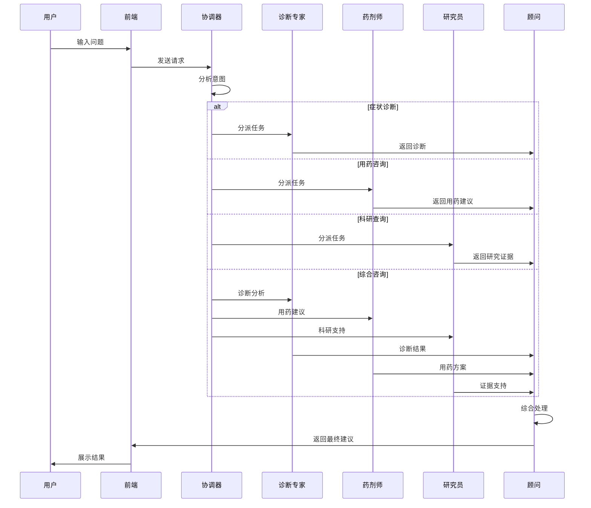

# 🏥 多智能体医疗咨询系统

一个基于 LangGraph 的多智能体医疗咨询系统，采用协作式 AI 架构，提供专业的症状诊断、用药建议、科研支持和健康咨询服务。

## 📋 项目概述

本项目是一个采用**多智能体协作架构**的全栈医疗咨询应用：

- **前端**：React 19 + TypeScript + Vite + Tailwind CSS ✅
- **后端**：Node.js + Express + TypeScript ✅
- **AI 框架**：LangGraph.js 多智能体工作流 ✅
- **LLM**：支持多模型（Gemini, GPT, Claude, DeepSeek 等）✅
- **架构模式**：5 个专业智能体协作 + 状态管理 ✅

## 🤖 多智能体架构

系统采用 **5 个专业智能体** 协同工作，每个智能体负责特定领域：


### 智能体职责

| 智能体 | 职责 | 核心能力 |
|--------|------|----------|
| 🎯 **协调器** | 分析用户意图，路由到合适的专家 | 意图识别、任务分派 |
| 🔍 **诊断专家** | 分析症状，提供初步诊断意见 | 症状分析、疾病推理 |
| 💊 **药剂师** | 提供用药建议，药物相互作用分析 | 用药指导、安全检查 |
| 📚 **研究员** | 检索医学文献和科研证据 | 文献检索、证据支持 |
| 💡 **顾问** | 综合所有信息，生成最终建议 | 信息整合、建议生成 |

## 🚀 快速开始

### 前置要求

- Node.js 20+
- npm 或 yarn
- Google Gemini API Key（或其他支持的 LLM API Key）

### 环境配置

1. **后端环境变量**

创建 `backend/.env` 文件：

```bash
# LLM API 配置
GEMINI_API_KEY=your_gemini_api_key_here
# 或使用其他模型
# OPENAI_API_KEY=your_openai_key
# ANTHROPIC_API_KEY=your_anthropic_key

# 服务器配置
PORT=3000
NODE_ENV=development
```

2. **前端环境变量（可选）**

创建 `frontend/.env` 文件：

```bash
VITE_API_URL=http://localhost:3000
```

### 安装和运行

#### 1. 克隆项目

```bash
git clone <repository-url>
cd langgraph-project
```

#### 2. 启动后端

```bash
cd backend
npm install
npm run dev
```

后端将在 http://localhost:3000 启动 ✅

#### 3. 启动前端

```bash
cd frontend
npm install
npm run dev
```

前端将在 http://localhost:5173 启动 ✅

### 快速测试

启动后，在前端界面尝试以下问题：
- "我最近头痛发热，该怎么办？"
- "阿莫西林的用法用量是什么？"
- "高血压有哪些最新的研究进展？"

## 📁 项目结构

```
langgraph-project/
├── backend/                      # Node.js 后端 ✅
│   ├── src/
│   │   ├── agents/              # 多智能体系统
│   │   │   ├── BaseAgent.ts     # 基础智能体类
│   │   │   ├── CoordinatorAgent.ts   # 协调器
│   │   │   ├── DiagnosticAgent.ts    # 诊断专家
│   │   │   ├── PharmacistAgent.ts    # 药剂师
│   │   │   ├── ResearchAgent.ts      # 研究员
│   │   │   ├── AdvisorAgent.ts       # 顾问
│   │   │   └── types.ts         # 类型定义
│   │   ├── services/
│   │   │   ├── llmService.ts    # LLM 服务封装
│   │   │   └── workflowService.ts    # LangGraph 工作流
│   │   ├── routes/
│   │   │   └── chatRoutes.ts    # API 路由
│   │   └── index.ts             # 服务入口
│   └── package.json
├── frontend/                     # React 前端 ✅
│   ├── src/
│   │   ├── components/          # UI 组件
│   │   │   ├── chat/            # 聊天相关组件
│   │   │   └── medicine/        # 药品信息组件
│   │   ├── services/
│   │   │   ├── api.ts           # API 客户端
│   │   │   └── chatService.ts   # 聊天服务
│   │   ├── types/               # 类型定义
│   │   ├── App.tsx              # 主应用
│   │   └── main.tsx             # 入口文件
│   └── package.json
├── docs/                        # 文档目录
├── shared/                      # 共享类型和工具
├── DATABASE_DESIGN.md           # 数据库设计文档
├── MULTI_AGENT_UPGRADE.md       # 多智能体升级指南
├── MULTI_MODEL_GUIDE.md         # 多模型配置指南
├── WORKFLOW_VS_AGENT.md         # 架构对比文档
├── TUTORIAL.md                  # 完整开发教程
└── START.md                     # 快速启动指南
```

## ✨ 功能特性

### 核心功能（已完成 ✅）

#### 🎯 多智能体协作系统
- ✅ 5 个专业智能体（协调器、诊断、药剂、研究、顾问）
- ✅ LangGraph 状态管理和工作流编排
- ✅ 智能路由和任务分派
- ✅ 上下文信息传递和状态共享

#### 💬 聊天交互
- ✅ 现代化聊天界面
- ✅ 实时消息流式传输
- ✅ 后端连接状态检测
- ✅ 响应式设计
- ✅ 加载动画和状态提示
- ✅ 示例问题快捷入口

#### 🧠 AI 能力
- ✅ 症状分析和初步诊断
- ✅ 用药建议和安全检查
- ✅ 医学文献检索和证据支持
- ✅ 综合建议生成
- ✅ 多轮对话上下文理解

#### 🔧 技术特性
- ✅ 支持多种 LLM（Gemini, GPT, Claude, DeepSeek）
- ✅ TypeScript 类型安全
- ✅ RESTful API 设计
- ✅ 错误处理和日志记录
- ✅ 可扩展的智能体架构

### 待实现功能

#### 前端增强
- ⏳ 药品信息可视化卡片
- ⏳ 聊天历史持久化
- ⏳ 用户认证和个人档案
- ⏳ 语音输入支持
- ⏳ 图片识别（药品说明书扫描）
- ⏳ 用药提醒和日历功能

#### 后端扩展
- ⏳ 数据库集成（用户、会话、历史）
- ⏳ 外部 API 集成（药品数据库、医学知识库）
- ⏳ 用户认证和授权
- ⏳ 缓存机制优化
- ⏳ 性能监控和分析
- ⏳ 部署优化和容器化

## 🛠️ 技术栈

### 前端
- **React 19** - 现代 UI 库
- **TypeScript** - 类型安全的 JavaScript 超集
- **Vite** - 快速的前端构建工具
- **Tailwind CSS** - 实用优先的 CSS 框架
- **Axios** - 基于 Promise 的 HTTP 客户端

### 后端
- **Node.js 20+** - JavaScript 运行时
- **Express** - 轻量级 Web 框架
- **TypeScript** - 类型安全开发
- **LangGraph.js** - 状态化多智能体工作流引擎
- **@langchain/core** - LangChain 核心库

### AI 和 LLM
- **Google Gemini** - 主要 LLM（支持 Pro 和 Flash）
- **OpenAI GPT** - 可选的 GPT-3.5/4 模型
- **Anthropic Claude** - 可选的 Claude 模型
- **DeepSeek** - 可选的国产大模型

### 开发工具
- **ESLint** - 代码质量检查
- **Prettier** - 代码格式化
- **tsx** - TypeScript 执行器
- **nodemon** - 开发热重载

## 📖 文档导航

本项目包含详细的设计和开发文档：

| 文档 | 描述 | 适用场景 |
|------|------|---------|
| [START.md](./START.md) | 快速启动指南 | 快速开始使用项目 |
| [TUTORIAL.md](./TUTORIAL.md) | 完整开发教程 | 学习如何从零搭建 |
| [MULTI_AGENT_UPGRADE.md](./MULTI_AGENT_UPGRADE.md) | 多智能体升级指南 | 了解架构演进 |
| [WORKFLOW_VS_AGENT.md](./WORKFLOW_VS_AGENT.md) | Workflow vs Agent 对比 | 理解两种架构差异 |
| [MULTI_MODEL_GUIDE.md](./MULTI_MODEL_GUIDE.md) | 多模型配置指南 | 配置不同的 LLM |
| [DATABASE_DESIGN.md](./DATABASE_DESIGN.md) | 数据库设计文档 | 数据结构设计参考 |

## 🎯 当前状态

### ✅ 已完成（第一阶段）

#### 核心架构
- [x] 多智能体系统设计与实现
- [x] LangGraph 工作流编排
- [x] 状态管理机制
- [x] 智能路由和任务分派

#### 前端开发
- [x] React 项目框架
- [x] Tailwind CSS 配置
- [x] 聊天界面 UI
- [x] API 服务层
- [x] 响应式设计

#### 后端开发
- [x] Express 服务器搭建
- [x] 5 个专业智能体实现
- [x] LLM 服务封装
- [x] RESTful API 设计
- [x] 错误处理和日志

#### 文档和配置
- [x] 完整的项目文档
- [x] 多模型支持配置
- [x] TypeScript 类型定义
- [x] 开发环境配置

### 🚧 进行中（第二阶段）

- [ ] 聊天历史持久化
- [ ] 用户认证系统
- [ ] 性能优化
- [ ] 测试覆盖

### 📅 计划中（第三阶段）

- [ ] 外部 API 集成（药品数据库）
- [ ] 高级功能（语音、图片）
- [ ] 部署和运维
- [ ] 监控和分析

## 🎨 系统工作流程



## 📸 界面预览

系统界面特点：
- 🎨 现代化设计风格
- 📱 完全响应式布局
- 🔄 实时状态反馈
- 💡 智能示例问题
- 🎯 清晰的信息层级

## 🤝 贡献指南

欢迎贡献代码！请遵循以下步骤：

1. **Fork 本项目**
2. **创建特性分支**
   ```bash
   git checkout -b feature/YourFeature
   ```
3. **提交更改**
   ```bash
   git commit -m '添加某个特性'
   ```
4. **推送到分支**
   ```bash
   git push origin feature/YourFeature
   ```
5. **开启 Pull Request**

### 代码规范
- 遵循 TypeScript 最佳实践
- 保持代码简洁易懂
- 添加必要的注释
- 编写单元测试
- 更新相关文档

## 💡 设计理念

### 为什么选择多智能体架构？

1. **专业分工** - 每个智能体专注于特定领域，提供更专业的服务
2. **可扩展性** - 易于添加新的智能体和功能
3. **可维护性** - 模块化设计，职责清晰
4. **灵活性** - 根据问题类型动态选择合适的智能体
5. **协作能力** - 多个智能体协同工作，提供全面的解决方案

### 关键技术选择

- **LangGraph** - 提供强大的状态管理和工作流编排能力
- **TypeScript** - 提供类型安全，减少运行时错误
- **React** - 成熟的前端框架，生态丰富
- **Express** - 轻量级后端框架，易于扩展

## ⚠️ 免责声明

> **重要提示：** 本应用提供的医疗信息仅供参考和教育目的，不能替代专业医生的诊断和建议。
> 
> - ❌ 不要将本系统的建议作为医疗诊断依据
> - ❌ 不要根据系统建议自行用药
> - ✅ 任何健康问题请咨询专业医生
> - ✅ 用药前请咨询医生或药师

本项目为技术演示和学习项目，展示了多智能体系统的实现方法。

## 📄 许可证

MIT License - 详见 [LICENSE](./LICENSE) 文件

## 🙏 致谢

感谢以下开源项目：
- [LangGraph.js](https://github.com/langchain-ai/langgraphjs) - 多智能体工作流框架
- [LangChain.js](https://github.com/langchain-ai/langchainjs) - AI 应用开发框架
- [React](https://react.dev/) - 前端 UI 框架
- [Tailwind CSS](https://tailwindcss.com/) - CSS 框架

## 📞 联系方式

如有问题或建议，欢迎：
- 提交 [Issue](../../issues)
- 发起 [Pull Request](../../pulls)
- 查看 [文档](./docs)

---

**🚀 项目状态：** 核心功能已完成，持续优化中

**⭐ 如果这个项目对你有帮助，请给个 Star！**
